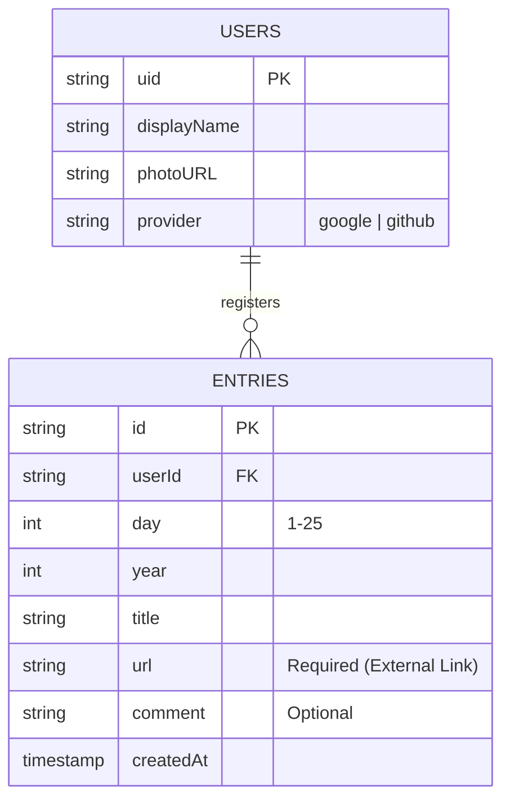
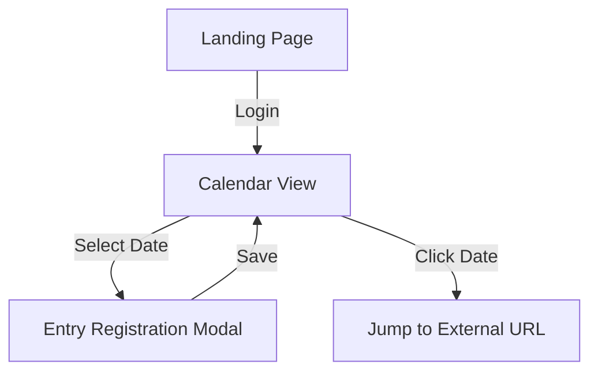

# Community Advent Calendar POC Design Document

## Overview
コミュニティ専用のQiita風Advent CalendarアプリケーションのPOC（概念実証）を作成します。
特定の年（例：2025年）に対して1つのカレンダーを作成し、ユーザーが記事を登録・閲覧できる機能を提供します。

## Goals / Non-Goals
- **Goals:**
    - 特定の年のAdvent Calendar（12月1日〜25日）を表示できること。
    - ユーザーが特定の日付を選択して、記事（URLとタイトル、または本文）を登録できること。
    - Firebase Authenticationを使用したユーザー認証（Googleログイン等）。
    - Firebase Firestoreを使用したデータの永続化。
    - Firebase Hostingへのデプロイ。
    - TypeScript + Reactによるモダンなフロントエンド実装。

- **Non-Goals:**
    - 複数年、複数カレンダーの作成（今回は単一カレンダーのみ）。
    - 複雑なソーシャル機能（いいね、コメント等）。
    - 記事自体の高度なエディタ機能（基本は外部記事へのリンク、または簡易的なテキスト入力を想定）。

## Architecture / Design

### Tech Stack
- **Frontend:** React (Vite), TypeScript, Tailwind CSS
- **UI Library:** shadcn/ui (Radix UI + Tailwind CSS)
- **Backend / DB:** Firebase Authentication, Firestore (or Supabase)
- **Hosting:** Firebase Hosting

### Data Model (Firestore)

### UI Flow

## Decisions
- **Framework:** Vite (React SPA)
- **Content Type:** External Links only (No internal blog post editor)
- **Styling:** shadcn/ui + Tailwind CSS
