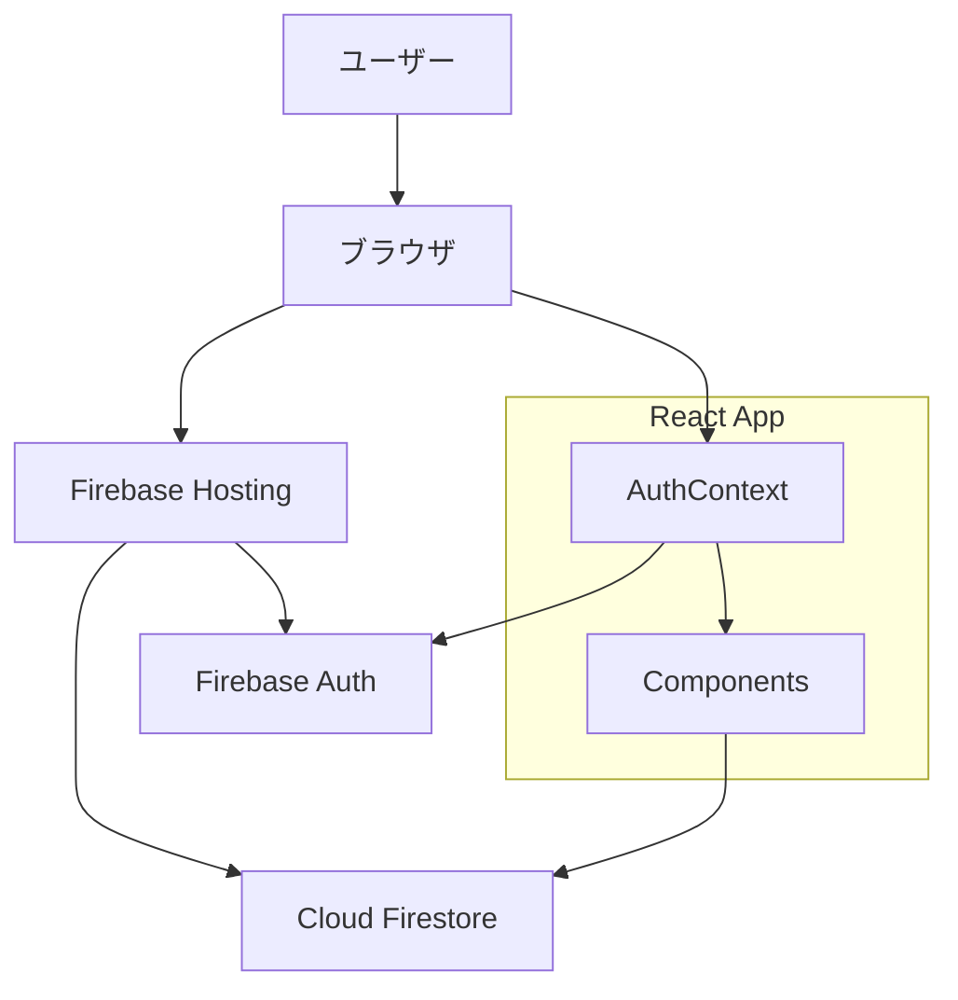
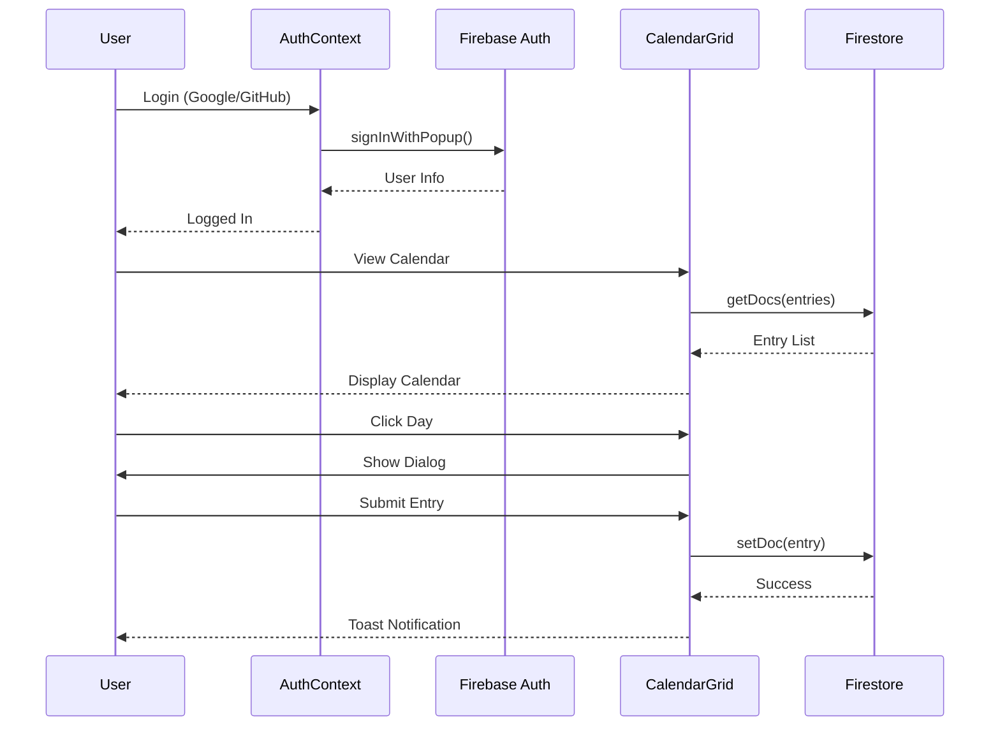

# Community Advent Calendar - ステアリングドキュメント

**バージョン**: 1.0 (POC)  
**最終更新**: 2025年11月20日  
**ステータス**: POC完成 → 次フェーズ検討中

---

## エグゼクティブサマリー

コミュニティ専用のAdvent CalendarアプリケーションのPOC（概念実証）が完成しました。基本機能（認証、記事登録、閲覧）が動作し、技術的な実現可能性が確認されました。次のフェーズでは、本番運用に向けた機能拡張とユーザビリティ改善を検討します。

### 現在の状況
- ✅ **POC完成**: 基本機能が動作確認済み
- ✅ **技術検証完了**: Firebase + React の構成で問題なく動作
- ⏳ **次フェーズ計画中**: 本番運用に向けた要件整理が必要

---

2. 記事の編集・削除UI（バックエンドは実装済み）
3. 未来日のロック機能（テスト用に無効化中）
4. エラーハンドリングの詳細化
5. パフォーマンス最適化

---

## 技術スタックと依存関係

### フロントエンド
| 技術 | バージョン | 用途 | 備考 |
|------|-----------|------|------|
| React | 19.2.0 | UIフレームワーク | 最新版を使用 |
| TypeScript | 5.9.3 | 型安全性 | 厳格モード有効 |
| Vite | 7.2.4 | ビルドツール | 高速な開発体験 |
| Tailwind CSS | 3.x | スタイリング | v4互換性問題あり |
| shadcn/ui | Latest | UIコンポーネント | Radix UI ベース |

### バックエンド・インフラ
| サービス | 用途 | 料金プラン | 制限 |
|---------|------|-----------|------|
| Firebase Authentication | ユーザー認証 | Spark (無料) | 無制限 |
| Cloud Firestore | データベース | Spark (無料) | 50K読取/日, 20K書込/日 |
| Firebase Hosting | ホスティング | Spark (無料) | 10GB/月 |

### 依存関係の注意点
- **Tailwind CSS v4**: shadcn/ui が自動的に v4 をインストールする問題あり → v3 に固定
- **TypeScript 設定**: `verbatimModuleSyntax` により型インポートを明示的に分離する必要あり

---

## アーキテクチャ概要

### システム構成図



### データフロー



### コンポーネント構成

```
App (AuthProvider)
├── Header
│   ├── Login Button / User Info
│   └── Login Dialog (Google/GitHub)
└── CalendarGrid
    ├── CalendarDay (x25)
    │   └── Entry Info / Empty State
    └── EntryDialog
        └── Form (Title, URL, Comment)
```

---

## 現在の課題とリスク

### 🔴 高優先度（本番運用前に必須）

| 課題 | 影響 | 対応策 | 期限 |
|------|------|--------|------|
| 未来日ロック機能が無効 | ユーザーが誤って未来の日付に登録可能 | `CalendarDay.tsx` の日付チェックを有効化 | 本番前 |
| エラーハンドリング不足 | ユーザーがエラー原因を理解できない | 詳細なエラーメッセージとリトライ機能の追加 | 本番前 |
| セキュリティルールが簡易的 | 悪意のあるユーザーによるデータ改ざんのリスク | より厳格なバリデーションルールの追加 | 本番前 |

### 🟡 中優先度（UX改善）

| 課題 | 影響 | 対応策 | 期限 |
|------|------|--------|------|
| 記事の編集・削除UIがない | 登録後の修正ができない | 編集・削除ボタンの追加 | Phase 2 |
| ローディング状態が簡易的 | ユーザーが待機状態を把握しづらい | スケルトンスクリーンの実装 | Phase 2 |
| レスポンシブ対応が不十分 | モバイルでの表示が最適化されていない | ブレークポイントの調整 | Phase 2 |

### 🟢 低優先度（機能拡張）

| 課題 | 影響 | 対応策 | 期限 |
|------|------|--------|------|
| 複数年対応がない | 毎年新規プロジェクトが必要 | 年選択機能の追加 | Phase 3 |
| ダークモード未対応 | ユーザー体験の低下 | システム設定に追従する実装 | Phase 3 |
| 検索機能がない | 過去の記事を探しづらい | タイトル検索機能の追加 | Phase 3 |

### 技術的負債

1. **Tailwind CSS バージョン管理**: shadcn/ui との互換性問題
   - **影響**: 将来的なアップデートが困難
   - **対応**: shadcn/ui の v4 対応を待つ、または別のUIライブラリを検討

2. **型インポートの冗長性**: `import type` の明示的な記述が必要
   - **影響**: コード量の増加、メンテナンス性の低下
   - **対応**: TypeScript 設定の見直し、または現状維持

3. **エラーハンドリングの統一性**: コンポーネントごとに異なる実装
   - **影響**: 保守性の低下
   - **対応**: エラーハンドリングのユーティリティ関数を作成

---

## 次のフェーズに向けた推奨事項

### Phase 1: 本番運用準備（優先度: 高）

**目標**: 安全に本番環境で運用できる状態にする

#### 必須タスク
- [ ] 未来日ロック機能の有効化
- [ ] Firestore セキュリティルールの強化
  - 1日1記事の制限
  - データバリデーション（URL形式、文字数制限）
- [ ] エラーハンドリングの改善
  - ネットワークエラー時のリトライ
  - 詳細なエラーメッセージ
- [ ] 環境変数の本番設定
  - Firebase Hosting での環境変数管理
- [ ] パフォーマンステスト
  - Lighthouse スコアの確認
  - 100人同時アクセスのシミュレーション

#### 推奨タスク
- [ ] GitHub Actions による CI/CD 設定
- [ ] Firebase Hosting へのデプロイ自動化
- [ ] エラー監視（Sentry など）の導入
- [ ] アクセス解析（Google Analytics）の導入

**期間**: 1〜2週間  
**リソース**: 開発者1名

### Phase 2: UX改善（優先度: 中）

**目標**: ユーザー体験を向上させ、実用性を高める

#### タスク
- [ ] 記事の編集・削除機能
  - 編集ダイアログの実装
  - 削除確認ダイアログの実装
- [ ] ローディング状態の改善
  - スケルトンスクリーン
  - プログレスバー
- [ ] レスポンシブデザインの最適化
  - モバイル表示の調整
  - タブレット表示の調整
- [ ] アクセシビリティ対応
  - キーボードナビゲーション
  - スクリーンリーダー対応
- [ ] OGP 対応
  - SNS シェア時のプレビュー画像

**期間**: 2〜3週間  
**リソース**: 開発者1名 + デザイナー0.5名

### Phase 3: 機能拡張（優先度: 低）

**目標**: より豊かな機能を提供し、コミュニティの活性化を図る

#### タスク
- [ ] 複数年対応
  - 年選択UI
  - 過去のカレンダー閲覧
- [ ] ダークモード対応
- [ ] 検索機能
  - タイトル検索
  - ユーザー検索
- [ ] コメント機能
  - 記事へのコメント
  - コメント通知
- [ ] いいね機能
  - 記事への評価
  - いいね数の表示
- [ ] 通知機能
  - 新規登録の通知
  - メンション通知

**期間**: 4〜6週間  
**リソース**: 開発者1〜2名

---

## 意思決定が必要な事項

### 1. 本番運用の開始時期

**選択肢**:
- **A. 2025年12月1日から運用開始**
  - メリット: 今年のアドベントカレンダーとして利用可能
  - デメリット: Phase 1 の完了が必須（約2週間）
  - 推奨: ⚠️ スケジュールがタイト

- **B. 2026年12月1日から運用開始**
  - メリット: 十分な開発・テスト期間を確保できる
  - デメリット: 1年間待つ必要がある
  - 推奨: ✅ 安全性を重視する場合

- **C. 2025年12月中旬からテスト運用**
  - メリット: 実環境でのフィードバックを得られる
  - デメリット: 途中からの参加になる
  - 推奨: 🤔 折衷案として検討可能

**推奨**: **B（2026年12月）** - 品質を担保し、Phase 2 の UX 改善も含めて完成度を高める

### 2. GitHub 認証の必要性

**現状**: ✅ Google/GitHub 認証ともに動作確認済み

**結論**: すでに実装・動作確認済みのため、意思決定不要。両方の認証方式が利用可能です。

### 3. 複数カレンダー対応の優先度

**現状**: 年ごとに1つのカレンダーのみ

**選択肢**:
- **A. Phase 2 で実装**
  - メリット: テーマ別カレンダーなど柔軟な運用が可能
  - デメリット: 開発工数が増加
  - 工数: 2〜3週間

- **B. Phase 3 で実装**
  - メリット: まずは基本機能に集中できる
  - デメリット: 初年度は1つのカレンダーのみ
  - 工数: 後回し

- **C. 実装しない**
  - メリット: シンプルさを保てる
  - デメリット: 拡張性が低い
  - 工数: 0時間

**推奨**: **B（Phase 3 で実装）** - まずは単一カレンダーで運用し、ニーズを確認してから拡張

### 4. ホスティング環境

**現状**: Firebase Hosting を想定

**選択肢**:
- **A. Firebase Hosting**
  - メリット: Firebase との統合が容易、無料枠が十分
  - デメリット: カスタムドメインの設定が必要
  - コスト: 無料（Spark プラン）

- **B. Vercel**
  - メリット: デプロイが簡単、プレビュー環境が自動生成
  - デメリット: Firebase との統合が若干複雑
  - コスト: 無料（Hobby プラン）

- **C. Cloudflare Pages**
  - メリット: 高速、無料枠が大きい
  - デメリット: Firebase との統合が複雑
  - コスト: 無料

**推奨**: **A（Firebase Hosting）** - Firebase との統合が最もシンプル

---

## リソース計画

### 開発リソース

| フェーズ | 期間 | 開発者 | デザイナー | 備考 |
|---------|------|--------|-----------|------|
| Phase 1 | 1〜2週間 | 1名 | - | 本番運用準備 |
| Phase 2 | 2〜3週間 | 1名 | 0.5名 | UX改善 |
| Phase 3 | 4〜6週間 | 1〜2名 | 0.5名 | 機能拡張 |

### コスト見積もり

| 項目 | 月額コスト | 年間コスト | 備考 |
|------|-----------|-----------|------|
| Firebase (Spark) | ¥0 | ¥0 | 無料枠内で運用可能 |
| ドメイン | ¥100〜 | ¥1,200〜 | 独自ドメイン使用時 |
| 監視ツール (Sentry) | ¥0 | ¥0 | 無料枠で十分 |
| **合計** | **¥100〜** | **¥1,200〜** | ほぼ無料で運用可能 |

**注**: ユーザー数が増加した場合、Firebase の従量課金プラン（Blaze）への移行が必要になる可能性あり（月額数千円〜）

---

## 成功指標（KPI）

### Phase 1（本番運用準備）

| 指標 | 目標値 | 測定方法 |
|------|--------|---------|
| Lighthouse スコア | 90以上 | Chrome DevTools |
| エラー率 | 1%未満 | Sentry |
| ページロード時間 | 2秒以内 | Lighthouse |

### Phase 2（UX改善）

| 指標 | 目標値 | 測定方法 |
|------|--------|---------|
| モバイル利用率 | 30%以上 | Google Analytics |
| 編集機能利用率 | 10%以上 | Firestore ログ |
| 平均セッション時間 | 3分以上 | Google Analytics |

### Phase 3（機能拡張）

| 指標 | 目標値 | 測定方法 |
|------|--------|---------|
| アクティブユーザー数 | 100人以上 | Firebase Analytics |
| 記事登録完了率 | 80%以上 | Firestore ログ |
| リピート率 | 50%以上 | Firebase Analytics |

---

## まとめと次のアクション

### 現状評価
- ✅ **技術的実現可能性**: 確認済み
- ✅ **基本機能**: 動作確認済み
- ⚠️ **本番運用準備**: 未完了（Phase 1 が必要）
- ❌ **UX最適化**: 未着手（Phase 2 が必要）

### 推奨される次のステップ

1. **即座に実施**:
   - [ ] 意思決定事項の確定（運用開始時期、GitHub認証の要否）
   - [ ] Phase 1 のタスク優先順位付け

2. **1週間以内**:
   - [ ] Phase 1 の開発開始
   - [ ] Firebase Hosting へのテストデプロイ
   - [ ] セキュリティルールの強化

3. **2週間以内**:
   - [ ] Phase 1 の完了
   - [ ] 内部テストの実施
   - [ ] Phase 2 の計画策定

### 承認が必要な事項

- [ ] 本番運用開始時期の決定
- [ ] Phase 1〜3 の予算承認
- [ ] リソース配分の承認
- [ ] 独自ドメインの取得可否

---

**次回レビュー予定**: Phase 1 完了後  
**担当者**: [担当者名を記入]  
**承認者**: [承認者名を記入]
