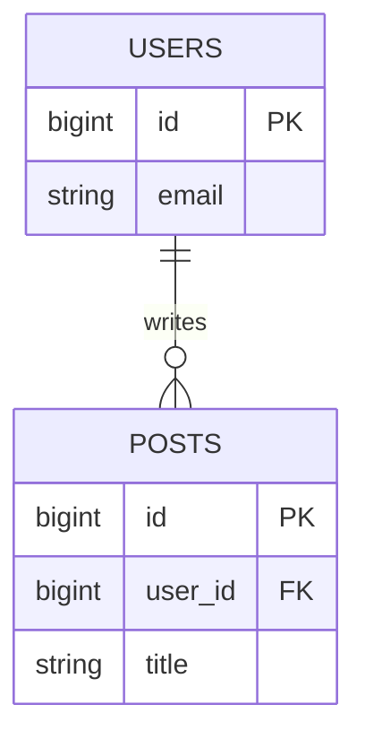

# [Table Name / Domain Name] Database Schema

## Overview
## ER Diagram


## Table Details
[table_name]
Description: 

```
| Column Name | Type | Nullable | Default | PK/FK | Description |
| :--- | :--- | :---: | :---: | :---: | :--- |
| id | BIGINT | No | Auto | PK | Primary Key |
| user_id | BIGINT | No | - | FK | Reference to users.id |
| status | VARCHAR(20) | No | 'active' | - | active, inactive, banned |
| created_at | TIMESTAMP | No | NOW() | - | 作成日時 |
| updated_at | TIMESTAMP | No | NOW() | - | 更新日時 |
```

## Indexes / Constraints
Primary Key: id

Foreign Keys: user_id -> users(id) ON DELETE CASCADE

Unique: (email, status)

Indexes: idx_users_email (email)


Table,Description,Critical Columns
users,ユーザー基本情報,"id, email, password_hash"
profiles,ユーザープロフィール詳細,"user_id, bio, avatar_url"